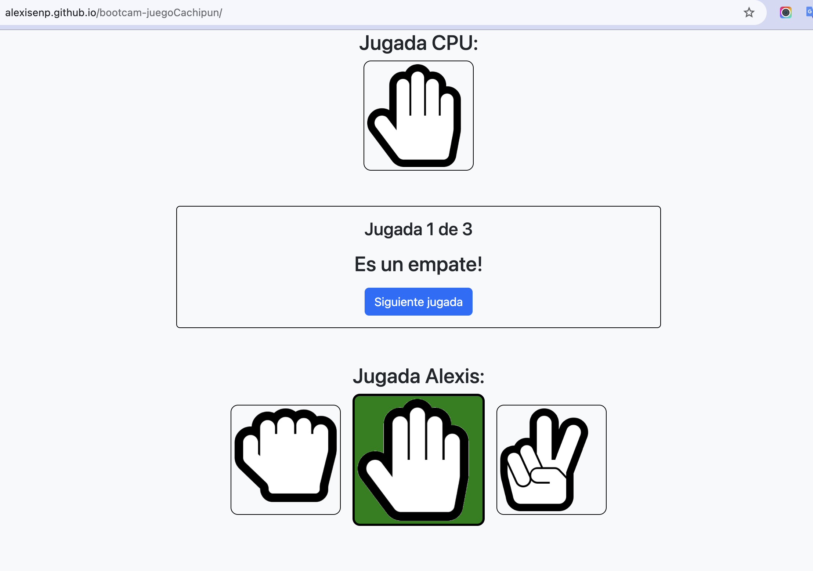

# Juego Cachipún (Piedra, Papel o Tijera)

[Ver juego aquí](https://alexisenp.github.io/bootcamp-juegoCachipun/)

## Descripción

Este es un juego de Cachipún (Piedra, Papel o Tijera) desarrollado como parte del bootcamp de Desarrollo de Aplicaciones Front-End de Talento Digital. El juego permite al usuario jugar contra la CPU y llevar un registro de los resultados de cada partida.

## Características

- **Interfaz Interactiva**: El usuario puede seleccionar entre las opciones de Piedra, Papel o Tijera, y la CPU selecciona su jugada automáticamente.
- **Resultados Dinámicos**: Los resultados de cada partida se muestran en tiempo real y se almacenan en una tabla para que el usuario pueda revisar todas las jugadas.
- **Contador de Jugadas**: Se muestra el número de jugada actual y cuántas quedan por jugar.
- **Reinicio del Juego**: El juego se puede reiniciar para empezar una nueva partida.

## Instrucciones de Uso

1. Clona este repositorio en tu máquina local.
   ```bash
   git clone https://github.com/tu_usuario/juego-cachipun.git


## Tecnologías Utilizadas
- **HTML5**: Estructura de la página y los elementos del juego.
- **CSS3 y Bootstrap**: Estilizado del juego, uso de clases de Bootstrap para una interfaz responsiva y atractiva.
- **JavaScript**: Lógica del juego, manejo de eventos y actualización dinámica de la interfaz.

